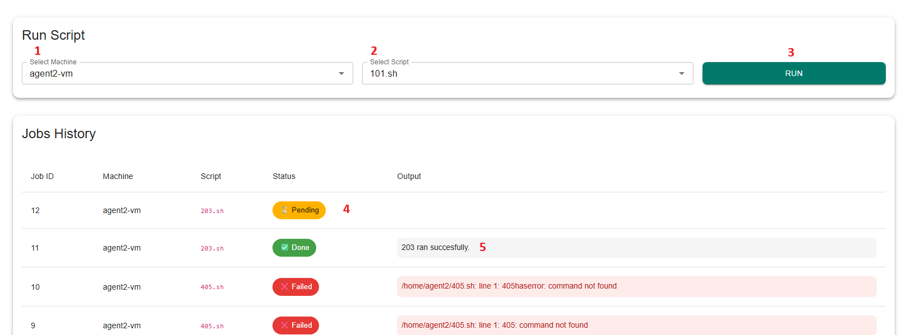
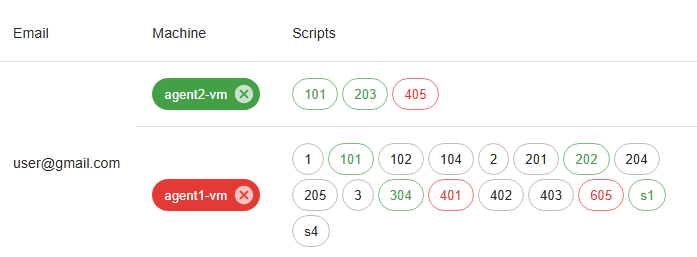

# Remote Script Execution Dashboard

## Overview
This application provides a secure way for administrators and customers to manage and execute shell scripts across multiple Ubuntu machines located in private networks.  
It is designed for scenarios where multiple customers share infrastructure, but must only have visibility and access to the machines and scripts explicitly assigned to them.

The platform offers:
- Role-based access (Admin / User).
- Secure machine registration and assignment.
- A user-friendly dashboard for script execution and monitoring.
- Logging and auditing of all actions.

---

## Key Features
- **Machine Registration**  
  New Ubuntu machines are registered via a `register.sh` script that securely connects them to the dashboard. Once registered, they appear as _unassigned_ until linked to a user.  
  ```bash
  chmod +x ./register.sh
  sudo ./register.sh
  ```
- **User & Machine Management**  
  Admins can create user accounts and assign one or more machines to them. Users will only see their assigned machines in the dashboard. All `.sh` files in `/home/xyz/` on a registered machine are exposed as clickable buttons in the UI. Users confirm before execution, ensuring safety.  


- **Job Queue**  
  When a user runs a script:
  1. A **job** is created and added to the central job queue with status **Pending**.
  2. Each machine runs an agent that polls the queue for jobs assigned to it.
  3. If the machine is online, it picks up the job, executes the script, and sends back results.
  4. The dashboard updates the job status to **Success** or **Failed**, with logs visible in the output column.
  

- **Statuses & Colors**  

  

  - **Machines**: 🟢 Green = online, 🔴 Red = offline.  
  - **Scripts**: ⚫ Grey = never run, 🟠 Orange = running, 🟢 Green = success, 🔴 Red = failed.  

- **Audit Logging**  
  Every script execution is logged with details of _who_ ran it, on _which machine_, and _when_.

---

## How It Works (Job Queue Model)
1. **User submits job** → Dashboard creates a pending job record.  
2. **Machine agent polls** → Checks for jobs assigned to its machine.  
3. **Script execution** → The machine runs the shell script locally.  
4. **Result reporting** → The machine posts back stdout/stderr and updates the job status.  
5. **Dashboard updates** → Users see real-time status changes and results in the UI.  

This decoupled job queue approach ensures:
- Machines don’t need to be directly exposed to the internet.  
- Jobs can safely wait in the queue until machines come online.  
- Users always have a clear record of past executions.  

---

## Use Cases
- Running maintenance scripts on distributed Ubuntu PCs.  
- Allowing multiple customers to safely manage their own machines.  
- Centralized monitoring of execution results across private networks.  
- Auditable execution history for compliance and debugging.  

---

## API documentation
You can explore the full **API documentation** and test endpoints via Swagger here:  
[Swagger API Docs](https://vendingmachinemanager-hl4m.vercel.app/docs) – This page provides an interactive interface for:
- Logging in and obtaining a JWT token
- Viewing machines and scripts assigned to the user
- Running scripts on specific machines
- Checking job status and logs

### Workflow Diagram


### Legend:

- JWT Token secures the endpoints

- Machines API provides user-specific machine & script list

- Jobs API handles script execution and tracking
